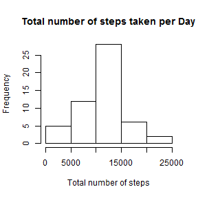
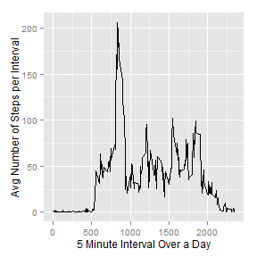
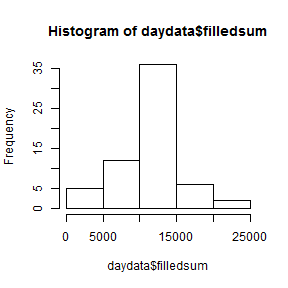
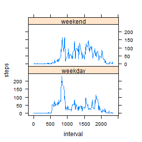

This is my first R Markdown document. This document will be used specifically for Assessment
1 in Johns Hopkins Coursera Course, "Reproducible Research."

We are looking at activity monitoring data and will create summary statistics and tables.

First, we load the data in.


```r
data <- read.csv('S:/Mitchell/Coursera/RepData/Assess1/activity.csv')
```

Now, we look to answer the first question. 

###"What is the mean total number of steps taken per day?"

To do this, we will create a histogram of number of steps per day, and from here,
we will extract the mean and median.

```r
#Initialize a data.frame
daydata <- c()
daydata$date <- unique(data$date)
daydata$numsteps <- tapply(data$steps, data$date, sum)
hist(daydata$numsteps, main='Total number of steps taken per Day',xlab='Total number of steps')
```

 

```r
#This is the mean number of steps per day
mean(daydata$numsteps,na.rm=T)
```

```
## [1] 10766.19
```

```r
#This is the median number of steps per day
quantile(daydata$numsteps, c(0.5),na.rm=T)
```

```
##   50% 
## 10765
```

Now, onto the second question. 

###"What is the average daily activity pattern?"


```r
#Load in the necessary libraries for plotting
library(ggplot2)
```

```
## Warning: package 'ggplot2' was built under R version 3.1.2
```

```r
#Create the data for the question
avgdata <- c()
avgdata$interval <- unique(data$interval)
avgdata$avgsteps <- tapply(data$steps,data$interval, mean,na.rm=T)
avgdata <- data.frame(avgdata)
#Create a time series plot of the 5-minute interval
g <- ggplot(data=avgdata,aes(x=interval,y=avgsteps)) + geom_line() +
  xlab('5 Minute Interval Over a Day') + ylab('Avg Number of Steps per Interval')
g
```

 

```r
#This is the highest avg number of steps
maxsteps <- max(avgdata$avgsteps)
maxsteps
```

```
## [1] 206.1698
```

```r
#This 5 minute interval has the maximum number of steps on average across all days.
avgdata$interval[avgdata$avgsteps>=maxsteps]
```

```
## [1] 835
```


Now, we will answer the third issue.

###"Inputting missing values."


```r
#Calculate and report the total number of missing values in the dataset
sum(is.na(data$steps))
```

```
## [1] 2304
```

```r
#Devise a strategy for filling in all of the missing values in the dataset.
#Create a new dataset that is equal to the original dataset but with the missing data filled in.
#Add in a column that matches the interval with the avg over the 7 days
library(plyr)
data <- mutate(data, newstep = tapply(steps, interval,mean,na.rm=T))
filleddata <- data[,1:3]
filleddata$steps <- ifelse(is.na(data$step), data$newstep,data$steps)

#Make a histogram of the total number of steps taken each day and calculate and report the mean and median total number of steps taken per day. Do these values differ from the estimates from the first part of the assignment? What is the impacct of imputing missing data on the estimateas of the total daily number of steps?
daydata$filledsum <- tapply(filleddata$steps, filleddata$date,sum,na.rm=T)
hist(daydata$filledsum)
```

 

```r
#This is the new mean
mean(daydata$filledsum)
```

```
## [1] 10766.19
```

```r
#This shows the difference between the filled and non-filled in means
mean(daydata$filledsum)-mean(daydata$numsteps,na.rm=T)
```

```
## [1] 0
```

```r
#This is the new median and the difference between the new and old median
median(daydata$filledsum)
```

```
## [1] 10766.19
```

```r
#This shows the difference between the filled and non-filled in medians
median(daydata$filledsum)-median(daydata$numsteps,na.rm=T)
```

```
## [1] 1.188679
```

Now that this is completed, we move onto the next question.

###"Are there differences in activity patterns between weekdays and weekends?"


```r
#Convert the date to a proper time variable
filleddata$date <- as.POSIXct(filleddata$date,format='%Y-%m-%d')
#Create a day of the week column
filleddata$day <- weekdays(filleddata$date)
#Create a factor variable with two levels
filleddata$weekend <- ifelse(filleddata$day == 'Saturday' | filleddata$day== 'Sunday','weekend','weekday')
filleddata$weekend <- factor(filleddata$weekend)
#Create a new data.frame to create the necessary graphs
weekendavg <- ddply(filleddata,c('weekend','interval'), function(x) return(c(steps=mean(x$steps))))
#Load library for graphs
library(lattice)
#Create the graph
xyplot(steps ~ interval | weekend, data=weekendavg, layout=c(1,2),type='l')
```

 

##This completes the assignment!!!


